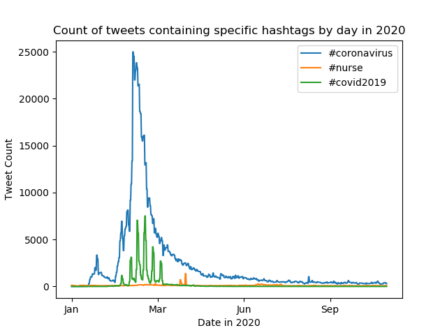

# Coronavirus twitter analysis

## Background
This project scans all geotagged tweets sent in 2020 to monitor for the spread of the coronavirus on social media. This project was completed as an assignment in Claremont McKenna College's CS046 Data Structures and Algorithms course taught by Mike Izbicki. 

It uses the MapReduce divide-and-conquer paradigm to create parallel code and handle large quantities of data.

## Background

**About the Data:**

Approximately 500 million tweets are sent everyday.
Of those tweets, about 2% are *geotagged*.
That is, the user's device includes location information about where the tweets were sent from.
The data set used in this project contains all geotagged tweets that were sent in 2020.
In total, there are about 1.1 billion tweets in this dataset.

## Results and Figures

This displays the total number of times the hashtag `#coronavirus` was used on 16 February in each of the languages supported by twitter.

